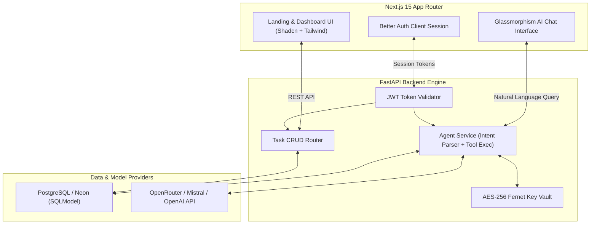

# TaskCortex — AI-Native Task Management & Autonomous Workflow Platform

> **An intelligent, full-stack task management platform allowing users to orchestrate tasks and complex daily workflows using natural language. Features a responsive glassmorphism UI, kanban grouping, Better Auth session security, and a BYOK agent reasoning engine.**

---

> **Created & Maintained by [Abdullah Qureshi](https://abdullah-qureshi.vercel.app)**  
> 🌐 **Portfolio**: [abdullah-qureshi.vercel.app](https://abdullah-qureshi.vercel.app) • 💼 **LinkedIn**: [abdullahqureshi27](https://www.linkedin.com/in/abdullahqureshi27) • 🐙 **GitHub**: [@abdullahqureshi27](https://github.com/abdullahqureshi27)

---

[](https://nextjs.org/)
[](https://fastapi.tiangolo.com/)
[](https://neon.tech/)
[](https://www.typescriptlang.org/)
[](https://python.org)
[](https://github.com/abdullahqureshi27/TaskCortex)

---

## 📸 Application Previews

| Landing Page | Interactive Task Dashboard |
|:---:|:---:|
|  |  |

---

## 🌟 Key Features

- 🤖 **Conversational AI Task Copilot**: Chat naturally with your assistant to schedule items, change priorities, search across backlog items, and complete tasks without clicking menus.
- 🔑 **Bring Your Own Key (BYOK) Architecture**: Individual users can configure their own LLM providers (Mistral, Groq, OpenRouter) with keys encrypted at rest using symmetric AES-256 Fernet cryptography.
- 📊 **Responsive Kanban Dashboard**: Interactive task columns, priority tags, instant search filtering, and drag-and-drop workflow status updates.
- 📱 **Mobile-First Glassmorphism Design**: Sleek sliding navigation drawer, frosted blur modals, and smooth micro-animations on all devices.
- 🔐 **Stateless JWT & Better Auth**: End-to-end authentication supporting session rotation, protected routes, and verified database ownership.
- 🌓 **Dynamic Theming**: First-class support for both high-contrast Light and Dark modes.

---

## 🏗️ Architecture & Data Flow



---

## 🛠️ Technology Stack

| Domain | Technology / Library | Purpose |
|---|---|---|
| **Frontend Framework** | [Next.js 15 (App Router)](https://nextjs.org/) | Server Components, routing, client views |
| **Frontend Styling** | [Tailwind CSS](https://tailwindcss.com/) + [Shadcn UI](https://ui.shadcn.com/) | Accessible primitives and glassmorphism styling |
| **Backend Framework** | [FastAPI](https://fastapi.tiangolo.com/) | Asynchronous high-throughput API endpoints |
| **Database & ORM** | [SQLModel](https://sqlmodel.tiangolo.com/) + [PostgreSQL](https://www.postgresql.org/) (Neon) | Type-safe schema validation and migrations |
| **Authentication** | [Better Auth](https://www.better-auth.com/) | Secure cookie, session, and credential handling |
| **AI Integration** | Mistral / OpenRouter API | Structured function calling & agent tool execution |
| **Security** | `cryptography` (Fernet AES-256) | Zero-knowledge client API key encryption at rest |

---

## 📂 Project Structure

```text
TaskCortex/
├── backend/                  # FastAPI Python Backend
│   ├── src/
│   │   ├── api/              # Strongly-typed route controllers
│   │   ├── models/           # SQLModel schemas (Tasks, Users, BYOK settings)
│   │   └── services/         # Agent executor & AES encryption logic
│   └── .env.example          # Backend environment template
├── frontend/                 # Next.js 15 TypeScript Frontend
│   ├── src/
│   │   ├── app/              # App Router routes ((landing), (dashboard), auth)
│   │   ├── components/       # UI, Kanban boards, AI chat drawer, footer
│   │   ├── lib/              # API clients, auth helpers, utilities
│   │   └── providers/        # Theme, task state, and auth context
│   └── .env.example          # Frontend environment template
└── docs/                     # Visual screenshots & architectural diagrams
```

---

## 🚀 Local Quickstart Guide

### Prerequisites
- Node.js 18+ and npm
- Python 3.10+
- PostgreSQL database (local or Neon Cloud instance)

### 1. Clone the Repository
```bash
git clone https://github.com/abdullahqureshi27/TaskCortex.git
cd TaskCortex
```

### 2. Configure & Run Backend
```bash
cd backend
python -m venv .venv
# Windows:
.venv\Scripts\activate
# Linux/macOS:
source .venv/bin/activate

pip install -r requirements.txt
cp .env.example .env

# Start FastAPI server
uvicorn src.main:app --reload --port 8000
```

### 3. Configure & Run Frontend
```bash
cd ../frontend
npm install
cp .env.example .env.local

# Start Next.js development server
npm run dev
```
Open [http://localhost:3000](http://localhost:3000) for the web client and [http://localhost:8000/docs](http://localhost:8000/docs) for the interactive Swagger documentation.

---

## 🧪 Testing & Verification

```bash
# Frontend build & typecheck
cd frontend
npm run build

# Backend syntax and import verification
cd ../backend
python -m py_compile src/main.py
```

---

## 👨‍💻 Author & Connect

**Abdullah Qureshi**  
*Full-Stack & AI Systems Engineer*

- 🌐 **Portfolio**: [https://abdullah-qureshi.vercel.app](https://abdullah-qureshi.vercel.app)
- 💼 **LinkedIn**: [https://www.linkedin.com/in/abdullahqureshi27](https://www.linkedin.com/in/abdullahqureshi27)
- 🐙 **GitHub**: [https://github.com/abdullahqureshi27](https://github.com/abdullahqureshi27)
- ✉️ **Contact**: [mabdullahqureshi583@gmail.com](mailto:mabdullahqureshi583@gmail.com)